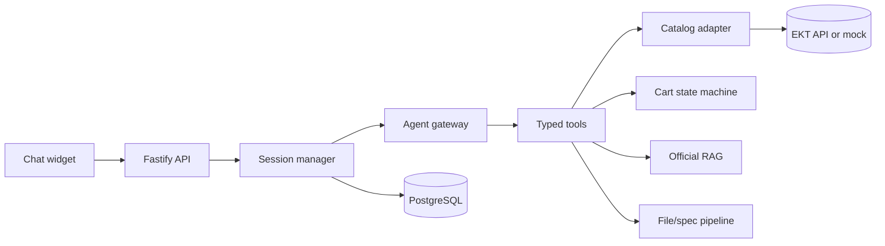

# EKT AI service

> **RETIRED — migration reference only.** The only supported server is now
> `../backend`, with `POST /api/assistant/chat`. Useful assistant logic has been
> migrated to `backend/src/modules/assistant/` in JavaScript/CommonJS and tested
> against the existing PostgreSQL/Prisma/cart services. Startup, build and legacy
> migration commands here are intentionally disabled. Nothing in this directory
> is imported by the main backend. Do not execute the archived instructions below.
> See [ASSISTANT_MIGRATION.md](../ASSISTANT_MIGRATION.md) for the migration map,
> verification, supported scope and files that can be removed after your review.

## Archived documentation (not the current architecture)

Backend for a safe bilingual commerce assistant for EKT electrical products. It searches a catalog, retrieves city-aware price/stock/certificates, ranks compatible analogs, processes specifications, and prepares cart changes — without allowing a model to mutate a cart or invent commercial facts.

## Architecture



Read [architecture details](docs/ARCHITECTURE.md), the [frontend contract](docs/FRONTEND_INTEGRATION.md), and [demo scenarios](docs/DEMO.md).

## Requirements

- Node.js 22+
- PostgreSQL 16+ running directly on your machine or managed host
- An EKT Catalog/Stock/Price/Cart API for `DATA_SOURCE=live`
- An OpenAI API key only when enabling the optional Responses API intent-classification adapter

## Install and run

```bash
cp .env.example .env
npm install
npm run db:migrate
npm run dev
```

On PowerShell, copy the environment file with `Copy-Item .env.example .env`.
Set `DATABASE_URL` in `.env` to the connection string of your existing PostgreSQL instance before running migrations. The server deliberately refuses to start without it.

Health checks:

```bash
curl http://localhost:3001/health
curl http://localhost:3001/ready
```

## Configuration

All credentials are environment variables. Do not commit `.env` files.

| Variable                                     | Purpose                                                                                                                                      |
| -------------------------------------------- | -------------------------------------------------------------------------------------------------------------------------------------------- |
| `DATA_SOURCE`                                | `mock` (default) or `live`; both obey the same catalog contract.                                                                             |
| `OPENAI_API_KEY`, `OPENAI_MODEL`             | Optional structured intent classifier. Model switching does not change business logic.                                                       |
| `EKT_CATALOG_API_URL`, `EKT_CATALOG_API_KEY` | Live catalog/stock/price integration.                                                                                                        |
| `EKT_CART_API_URL`                           | Live cart adapter integration.                                                                                                               |
| `DATABASE_URL`                               | Required direct PostgreSQL connection. Persists sessions, cart proposals, file metadata, specification analyses, handoffs, and audit events. |
| `CORS_ORIGINS`, `SESSION_SIGNING_SECRET`     | Browser boundary and session security.                                                                                                       |

## Mock and live modes

`DATA_SOURCE=mock` supplies a deterministic, realistic multi-category catalog under the same adapter interfaces used by a future EKT HTTP adapter. It is for development/demo only.

`DATA_SOURCE=live` must fail ready-state validation until the real catalog credentials are configured. The agent never falls back to model memory when a live adapter lacks a price, stock level, or certificate.

## API

| Method | Endpoint                         | Purpose                                       |
| ------ | -------------------------------- | --------------------------------------------- |
| POST   | `/api/chat`                      | Session-aware chat, JSON or SSE.              |
| GET    | `/api/chat/:sessionId`           | Session state.                                |
| POST   | `/api/files`                     | Validated file upload.                        |
| POST   | `/api/cart/proposal`             | Prepare a non-mutating cart proposal.         |
| POST   | `/api/cart/confirm`              | Explicitly confirm and revalidate a proposal. |
| GET    | `/api/cart`                      | Current cart snapshot.                        |
| GET    | `/api/products/search`           | City-aware product search.                    |
| GET    | `/api/products/:id`              | Product card.                                 |
| GET    | `/api/products/:id/stock`        | Current stock.                                |
| GET    | `/api/products/:id/certificates` | Official documents.                           |
| GET    | `/api/products/:id/analogs`      | Compatibility-first analogs.                  |
| POST   | `/api/specifications/analyze`    | Specification analysis.                       |
| GET    | `/api/specifications/:id`        | Analysis result.                              |
| POST   | `/api/handoff`                   | Structured manager handoff.                   |
| GET    | `/health`, `/ready`              | Liveness and dependency readiness.            |

## Cart confirmation guarantee

The cart uses `prepare → explicit confirm → revalidate → mutate`.

1. `POST /api/cart/proposal` obtains live price and stock and returns a short-lived proposal plus an opaque confirmation token.
2. No acknowledgement such as “ок”, “нормально”, or a product-card click can mutate the cart.
3. `POST /api/cart/confirm` checks proposal expiry, session/user ownership, token, idempotency key, product status, price, and stock again.
4. The only adapter allowed to update a cart returns the authoritative cart URL.

## RAG and file indexing

Only EKT-approved delivery, payment, return, FAQ, certificate, and technical documents enter the RAG store. Each chunk has source URL, language, type, product/category, and timestamp metadata. The base PostgreSQL schema stores optional embeddings as JSONB, so no database extension is required.

Files are input data, not instructions. The upload boundary validates extension/mime/size, excludes prompt-injection-like instructions, extracts line items, batches matching, and never auto-adds results to a cart.

## Security

- Zod validation at every HTTP/tool boundary
- CORS allowlist and rate limiting
- Server-side session ownership, confirmation tokens, TTLs, and idempotency
- Append-only audit events for cart actions
- No credentials, payment data, CVVs, or raw secrets in logs
- City/warehouse required where commerce data is regional
- Compatibility hard filters before any analog ranking
- Unsafe electrical work requests are routed to a qualified specialist

## Testing and evaluation

```bash
npm run build
npm test
npm run lint
```

The safety suite covers no-cart-without-confirmation, duplicate confirmation, proposal expiry, price/stock changes, city requirements, prompt injection isolation, and compatibility filtering. Add EKT production fixtures and at least 50 bilingual evaluation cases before launch.

## PostgreSQL setup

```bash
createdb ekt_ai
npm run db:migrate
```

Use your own local or managed PostgreSQL server. `npm run db:migrate` applies the versioned SQL files and records them in `schema_migrations`; it is safe to run again. No container runtime or cache service is used by this backend.
