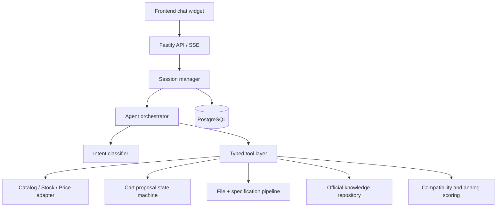
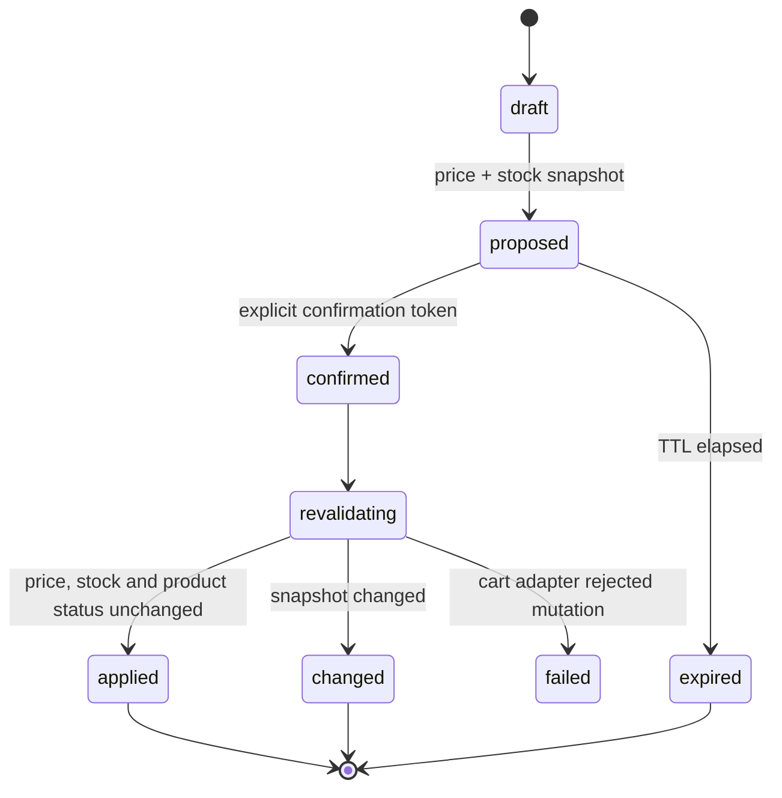

# EKT AI architecture

EKT AI is a backend-first, tool-driven commerce assistant. The model may classify intent and form a response, but it never has direct access to a cart, database, credentials, price, or stock mutation.

## Source-of-truth order

1. Live catalog, stock, price, and cart adapters.
2. EKT-approved knowledge and product documents.
3. Retrieval results with source metadata.
4. Current session context.

An LLM's training data is never a source for price, stock, certificates, or cart state. `DATA_SOURCE=mock` uses the same adapter contracts for local development; `DATA_SOURCE=live` requires the EKT integration variables.

The server uses one direct PostgreSQL pool for durable sessions, cart proposals, file metadata, specification snapshots, handoffs, and audit events. Unit tests may inject in-memory adapters, but the normal server entry point requires `DATABASE_URL`.

## Cart state machine

Only exact cart confirmation phrases or an explicit UI confirmation can progress a proposal. “Нормально”, “ок”, “интересно”, and similar acknowledgements never mutate a cart.

## Key risks and controls

| Risk                         | Control                                                                                            |
| ---------------------------- | -------------------------------------------------------------------------------------------------- |
| Wrong city price/stock       | City is mandatory for price, stock, analogs and carts; return `CITY_REQUIRED` instead of guessing. |
| Accidental cart mutation     | Server-owned token, session ownership, TTL, idempotency, and revalidation.                         |
| Unsafe analog                | Category hard constraints filter candidates before explainable ranking.                            |
| Prompt injection in files    | File text is isolated as data; instruction-like content is removed before matching.                |
| Hallucinated commercial data | All product facts are returned by typed adapters only.                                             |
